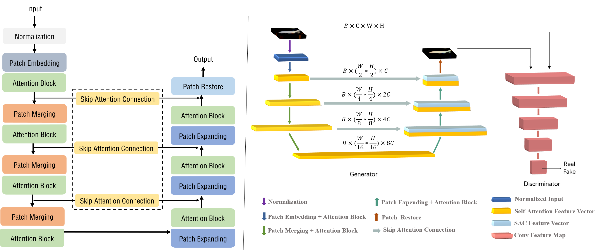
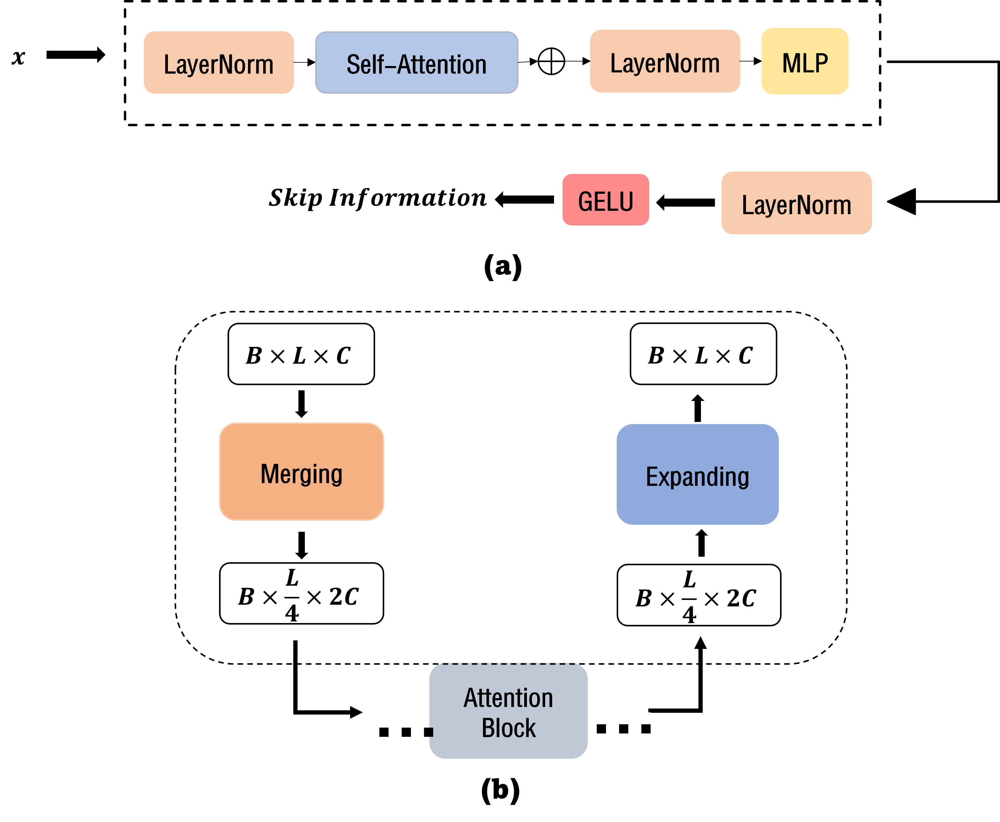
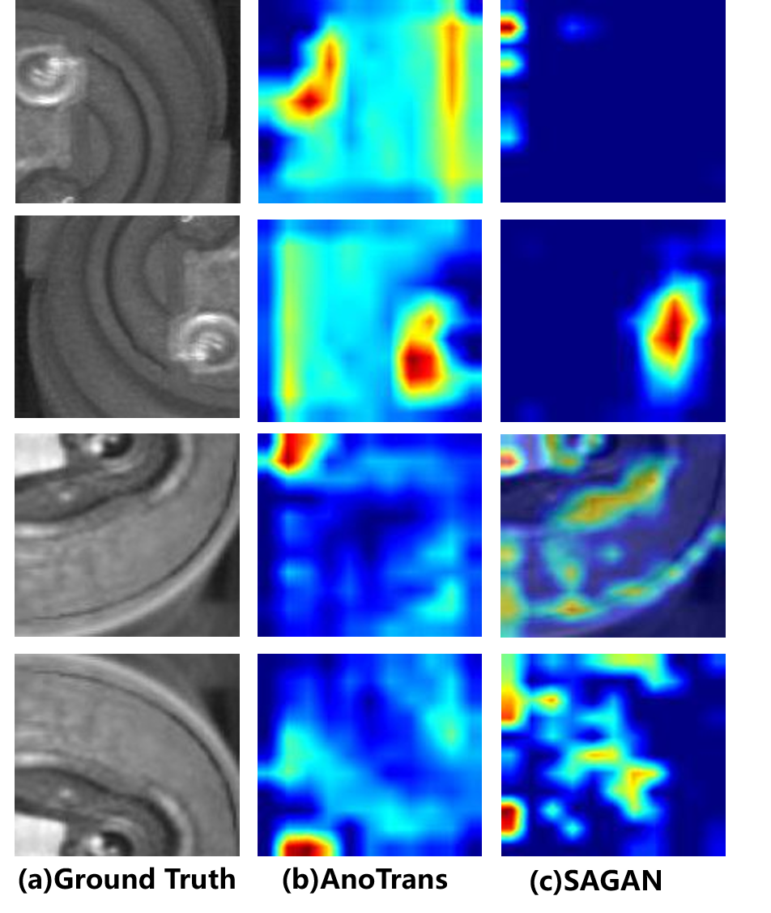

# A Transformer-based GAN For Anomaly Detection

This repository contains PyTorch implementation of the following paper: **A Transformer-based GAN for Anomaly Detection**. This paper was accepted by ICANN2022




<center class="half">
    </center>

## Paper Introduction

Anomaly detection is the task of detecting outliers from normal data. Numerous methods have been proposed to address this problem, including recent methods based on generative adversarial network(GAN). However, these methods are limited in capturing the long-range information in data due to the limited receptive field obtained by the convolution operation. The long-range information is crucial for producing distinctive representation for normal data belonging to different classes, while the local information is important for distinguishing normal data from abnormal data, if they belong to the same class. In this paper, we propose a novel Transformer-based architecture for anomaly detec-
tion which has advantages in extracting features with global information representing different classes as well as the local details useful for capturing anomalies. In our design, we introduce self-attention mechanism into the generator of GAN to extract global semantic information, and also modify the skip-connection to capture local details in multi-scale from input data. The experiments on CIFAR10 and STL10 show that our method provides better performance on representing different classes as compared with the state-of-art CNN-based GAN methods. Experiments performed on MVTecAD and LBOT datasets show that the proposed method offers state-of-art results, outperforming the baseline method SAGAN by over 3% in terms of the AUC metric.

## Installation

1. First clone the repository
   ```
   git clone https://github.com/samet-akcay/skip-ganomaly.git
   ```
2. Create the virtual environment via conda
    ```
    conda create -n anoTrans python=3.8
    ```
3. Activate the virtual environment.
    ```
    conda activate anoTrans
    ```
4. Install the dependencies.
   ```
   pip install --user --requirement requirements.txt
   ```
   
## Experiment

To replicate the results in the paper for CIFAR10  dataset, run the following commands:

``` shell
# CIFAR
sh experiments/run_cifar.sh
```

## Training
To list the arguments, run the following command:
```
python train.py -h
```

### Training on CIFAR10
To train the model on CIFAR10 dataset for a given anomaly class, run the following:

``` 
python train.py \
    --dataset cifar10                                                             \
    --niter <number-of-epochs>                                                    \
    --abnormal_class                                                              \
        <airplane, automobile, bird, cat, deer, dog, frog, horse, ship, truck>    \
    --display                                   # optional if you want to visualize        
```

### Train on Custom Dataset
To train the model on a custom dataset, the dataset should be copied into `./data` directory, and should have the following directory & file structure:

```
Custom Dataset
├── test
│   ├── 0.normal
│   │   └── normal_tst_img_0.png
│   │   └── normal_tst_img_1.png
│   │   ...
│   │   └── normal_tst_img_n.png
│   ├── 1.abnormal
│   │   └── abnormal_tst_img_0.png
│   │   └── abnormal_tst_img_1.png
│   │   ...
│   │   └── abnormal_tst_img_m.png
├── train
│   ├── 0.normal
│   │   └── normal_tst_img_0.png
│   │   └── normal_tst_img_1.png
│   │   ...
│   │   └── normal_tst_img_t.png

```

Then model training is the same as the training explained above.

```
python train.py                     \
    --dataset <name-of-the-data>    \
    --isize <image-size>            \
    --niter <number-of-epochs>      \
    --display                       # optional if you want to visualize
```

For more training options, run `python train.py -h`.

